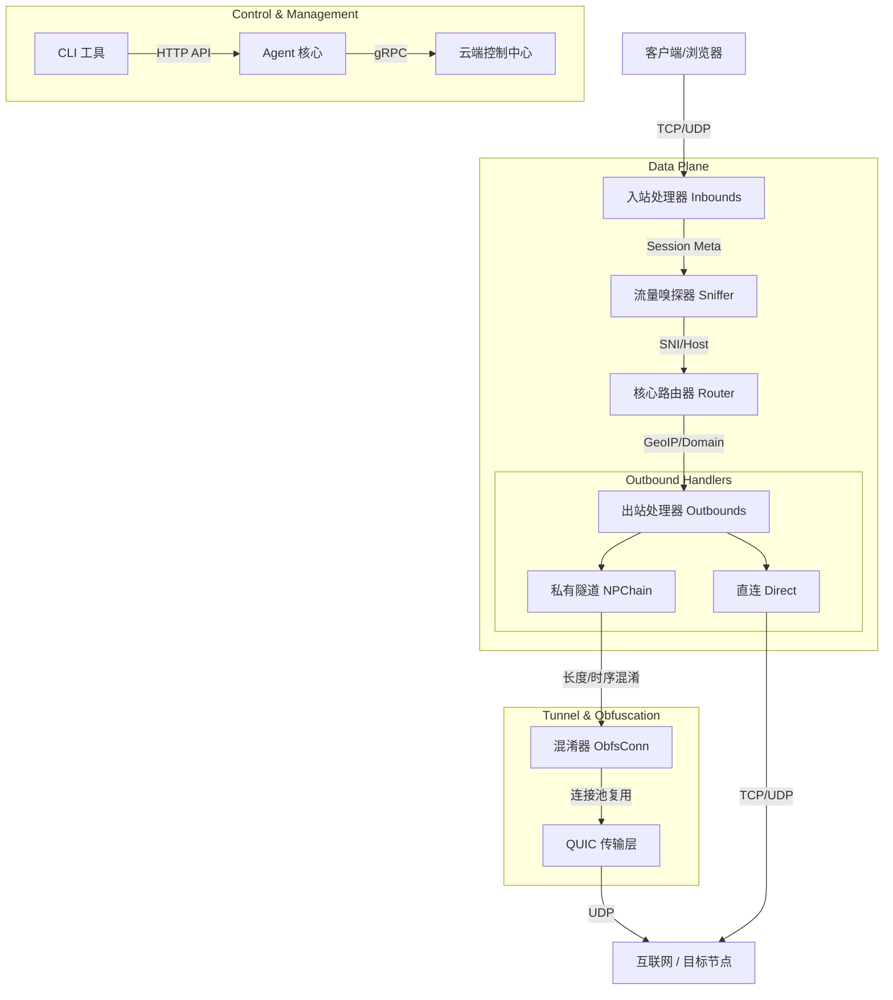

# NodePro 2.0 架构设计

NodePro 2.0 是一个高性能、高隐蔽性的下一代安全内网穿透与代理系统。本架构设计文档详细阐述了系统的核心组件、数据流转、并发模型以及性能优化策略。

## 1. 总体架构图

系统在逻辑上分为三大平面：

*   **数据平面 (Data Plane)**：负责处理实际的网络流量，包含协议解析、流量嗅探、路由分发、隧道封装和混淆。
*   **控制平面 (Control Plane)**：基于 gRPC 实现的云端管理信道，负责节点注册、心跳上报和动态策略下发。
*   **管理平面 (Management Plane)**：提供本地的 Admin API 和 CLI 工具 (`npctl`)，用于本地人工干预、状态查询和排错。

## 2. 核心组件解析

### 2.1 入站处理器 (Inbounds)
入站处理器负责接收和初步解析客户端请求，将其转换为统一的内部会话 (`SessionMeta`)。
*   **支持协议**：HTTP Proxy, SOCKS5 (TCP/UDP), TCP/UDP 端口转发, TProxy, Redirect。
*   **Proxy Protocol**：所有的 Inbound 均可配置支持 Proxy Protocol (v1/v2)，以便部署在 Nginx/HAProxy 等负载均衡器后获取真实客户端 IP。

### 2.2 流量嗅探器 (Sniffer)
位于数据链路的最前端。即使客户端（如透明代理模式）只提供了目标 IP，嗅探器也能通过预读数据包 (`Peek`) 提取真实的目标域名。
*   **TLS SNI 提取**：解析 TLS Client Hello。
*   **HTTP Host 提取**：解析 HTTP 文本头。
*   零损耗回放技术，确保嗅探过程不对后续的 `Relay` 产生副作用。

### 2.3 核心路由器 (Router)
基于嗅探到的域名和源 IP，结合配置文件中的规则，决定流量的去向。
*   **智能 DNS**：集成 DoH/DoT 及并行竞速查询，支持根据域名规则分流 DNS 请求（国内直连，国外走隧道）。
*   **Fake IP**：零延迟的 DNS 响应机制。将假 IP 与域名双向绑定，流量到达 Router 时自动还原域名。

### 2.4 出站处理器与隧道 (Outbounds & NPChain)
*   **Direct**：原生 TCP/UDP 直连。
*   **NPChain**：NodePro 专有隧道协议。
    *   **应用层连接池 (Multipath/Pooling)**：在底层维持多个物理 `quic.Conn`，新的请求通过 Round-Robin 分发至不同连接的 Stream，打破单通道吞吐瓶颈。
    *   **流量混淆 (Obfuscation)**：支持长度随机填充（Padding）和时序抖动（Dummy/Heartbeat），对抗基于长度分布和包时序的 DPI 深度检测。

## 3. 性能优化策略

1.  **Buffer Pool**：全局共享 32KB 内存池 (`sync.Pool`)，避免高吞吐下的 GC 抖动。移除了归还时的强制清零逻辑，进一步降低 CPU 开销。
2.  **TCP 网络栈优化**：全局默认开启 `TCP_NODELAY` 并在系统层面微调缓冲区大小。
3.  **QUIC 窗口调优**：为适应长距离弱网链路（BDP），将 QUIC 的流接收窗口和连接接收窗口提升至 `32MB/64MB`。
4.  **无锁/低锁设计**：在核心 `Relay` 循环中，统计信息的更新采用 `defer` 批处理，最大限度减少对 `sync.Map` 的竞争访问。
